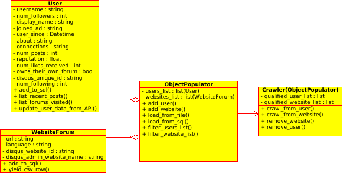

# Crawling the Disqus API

Disqus is a commentary platform for websites where site visitors to online blogs, newspapers, magazines can air their thoughts and discuss the content, vote each other up and down etc. Many German newspapers nowadays organise their own commentary infrastructure, but there are still many left such as [Münchener Merkur](https://www.merkur.de/) which are using Disqus. 

Disqus has an API with [many different methods](https://disqus.com/api/docs/) for querying around users, threads, topics etc. [This diagram](https://help.disqus.com/customer/portal/articles/1132577) shows how the main components fit together, anyone who has ever read or written a comment on the internet will understand it. They provide [Python bindings](https://github.com/disqus/disqus-python) for the API and on this occasion, I can positively report that they worked very well and were not hard to learn.  

## What you can do and what you can't

So after extensively testing out the methods (see this notebook) it became clear that there were certain things you could not do with the API. Well, they don't want you to do them. The thing I most wanted to do which after extensive Stackoverflow readings realised was not explicitly possible was to obtain a list of all or many websites in Germany using disqus.

## The solution

A crawling mechanism. Start on one German website with disqus, crawl users and with the assumption that they spend most of their time on other German sites, fill up a database with the websites where their other activities take place. 

## Object Oriented 
_(September 2017)_

I wrote a series of functions in a Jupyter Notebook for this crawler earlier in the year. They successfully crawled disqus on a small scale and after being seeded with one German site, crawled through the users to populate a list of other sites. It interacted with `sqlite3` Although it worked, it was very much a prototype, messy, not adequately systematic, not scalable. I sensed at the time it needed classes not just functions to clean it up. There was excessive repetition instead of a **single source of truth.** It simply takes more thought and planning to do it right, but back then, the concept was at least proven. 

Here is an small extract of the output from back then:

```
currentDeDisqusSites = list(set(df[df['language'] == 'de']['visited_site']))

['http://ksta.de/',
 'http://community.socialmediaakademie.de/',
 'http://www.menzin.de',
 'http://auto-presse.de/',
 'http://www.mobilegeeks.de/',
 'http://www.11freunde.de/',
 'http://berliner-zeitung.de',
 'http://www.macwelt.de',
 'http://www.fussball-vorort.de',
 ]

```

## UML for the new design

 
